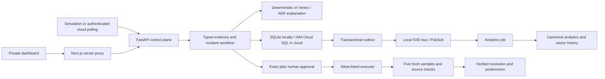

# Architecture

The existing deterministic domain workflow remains the control plane in every provider mode. FastAPI exposes operational resources and authenticated mutations; the dashboard's server proxy attaches runtime credentials, including a Cloud Run identity token, and streams SSE without returning credentials to the browser.

`providers/contracts.py` defines typed boundaries. Factory configuration selects local or GCP implementations without replacing agent rules. Cloud reads use SDKs and ADC; runtime identities and narrowly scoped executor impersonation provide cloud permissions. The API identity has no direct Cloud Run administrative grant.

Incidents, approval/execution claims, audit and outgoing events are durable transactional records. Optimistic versions prevent stale writes and concurrent execution. Publication failure leaves a stable-ID outbox event for retry. Analytics acknowledges only after successful storage, and also upserts verified resolution history before acknowledgement. Streaming insert IDs are best-effort deduplication; consumers of analytics use `canonical_domain_events` for one row per event ID.

Cloud polling validates the sole monitored service, bounded payloads, timestamp freshness and replay behavior. It triggers investigation only. It cannot execute actions or overwrite an active local scenario. Cloud logs/revisions have stable IDs across polls.

The deployment currently uses one active API instance and one Uvicorn worker. In-process locks, SSE subscriptions and restart handling make horizontal API scaling unsupported. Revision transitions can still overlap briefly; optimistic claims protect action replay, but distributed workflow leases and SSE fan-out are future scaling work. A restart marks interrupted workflows failed for operator review rather than silently replaying privileged actions.

The private `orders-api` workload is a bounded demonstration target, with no runtime fault injection or cloud privileges. Set `create_demo_target=false` for an existing service. Service IDs are currently deliberately allow-listed to `orders-api`; this is not a multi-tenant operations platform.
